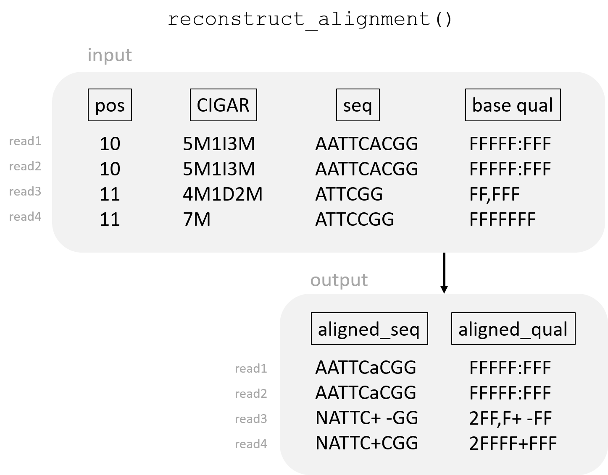

  
```{css, echo=FALSE}
body .main-container {
  max-width: 1280px !important;
  width: 1280px !important;
}
body {
  max-width: 1280px !important;
}
```

```{r setup, include=FALSE}
knitr::opts_chunk$set(echo = TRUE)
```

<br/>

# **Summary**

`DuplexUMIConsensusReads` calls consensus reads from input reads generated from the same double-stranded DNA molecule.

These input reads are assumed to:

* be generated from paired-end sequencing 

* be generated from DNA fragments with Unique Molecular Identifiers (UMIs) attached in both ends (Duplex-UMIs).

  
The mathematical and probabilistic procedure to determine the consensus sequence is based on [fulcrumgenomics CallMolecularConsensusReads tool](https://github.com/fulcrumgenomics/fgbio/wiki/Calling-Consensus-Reads).
  
The novel feature of this tool is the fact that mapping information of the consensus reads is also computed. This includes _mapping position_, _mapping quality_ and _CIGAR string_ fields. Therefore, there is no need to map the consensus reads again after using this tool. 

This feature is contained in the script function `make_consensus_read()`, which is the core of the script and is explained in this [Section](#function).

`DuplexUMIConsensusReads` is implemented in Python and uses [pysam](https://pysam.readthedocs.io/en/latest/api.html) library to parse and handle reads.

<br/>


# **How to use**
<br/>

## Installation

Download the script `DuplexUMIConsensusReads.py`

or clone the repository:
```
git clone https://github.com/paurrodri/DuplexUMIConsensusReads.git
```
<br/>

## Dependencies

`DuplexUMIConsensusReads` is dependent on Python >= 3.6. 
  
It requires the following libraries:

* sys
* argparse
* math
* random
* numpy
* pysam

<br/>

## Usage

Run:
```
python3 DuplexUMIConsensusReads.py -i <inputfile.bam>
``` 
<br/>

### Required arguments

The only required argument is the **input file**, given as `-i` or `--input_file`.
  
The input file is assumed to:

* be a binary Sequence Alignment/Map file (`.bam` format)
* have reads generated by paired-end sequencing, from a library with Duplex Unique Molecular Identifiers (Duplex-UMI) attached to the DNA fragments
* have the reads sorted by position
* have the Duplex-UMI sequence specified in every read, with the tag `RX`
* have the family code specified in every read, with the tag `MI`. This family code is unique for each combination of Duplex UMI sequences

The current version of `DuplexUMIConsensusReads` is recommended to be used for input files that had been processed by [fulcrumgenomics GroupReadsByUMI tool](http://fulcrumgenomics.github.io/fgbio/tools/latest/GroupReadsByUmi.html)

<br/>

### Optional arguments

Optional arguments in `DuplexUMIConsensusReads` are:

| argument | flag | long option | type | description | default |
|------------------------------------|------|----------------------------|------|------------------------------------------------------------------------------------------------------------------------------------------------------------------------------------------------------|---------------------------|
| output file | -o | --output_file | str | name of the output .bam file with consensus reads | <input_filename>_cons.bam |
| verbose | -v | --verbose |  | add this option to display how the program is running |  |
| minimum mapping quality | -q | --min_map_quality | int | minimum mapping quality (given as Phred score) of a read to be used to generate the consensus read | 20                                                                                                                                                                                                      |
| minimum base quality |  | --min_base_quality | int | minimum base quality (given as Phred score) for a base not to be masked | 20                                                                                                                                                                                                      |
| minimum read number |  | --min_reads | int | minimum number of reads from the same sub-family to generate a single-strand consensus read | 1         |
| maximum read number |  | --max_reads | int | maximum number of reads from the same sub-family to generate a single-strand consensus read | 100                                                                                                                                                                                                                                                                                                                                                                                                                                                                                                                                                                                                                                                                                                                                                                                                                                                                                                                                                                                                                                     |
| maximum base quality |  | --max_base_quality | int | Recommended to use in case of overestimated base qualities. All bases with a quality greather than this value (given as a Phred score) will be capped before calling consensus. | 60                                                                                                                                                                                                                                                                                                                                                                                                                                                                                                                                                                                                                      |
| base quality shift |  | --base_quality_shift | int | Recommended to use in case of overestimated base qualities. All base qualities will be substracted this value (given as a Phred score) before calling consensus. | 0 |
| error rate post labeling |  | --error_rate_post_labeling | int | Recommended to use in case of having prior knowledge about this error. Error rate for an error after the UMIs have been integrated to the fragment, but prior to sequencing. Given as a Phred score. | 0 |
| error rate pre labeling |  | --error_rate_pre_labeling | int | Recommended to use in case of having prior knowledge about this error. Error rate for an errror before the UMIs have been integrated to the fragment. Given as a Phred score. | 0 |
| deletion score |  | --deletion_score | int | quality score (Phred score) for a deletion | 30                                                                                                                                                                                                                                                                                                          |
| score for the absence of insertion |  | --no_insertion_score | int | Quality score (Phred score) for the "absence of an insertion". This refers to reads not having any insertion in a position where other reads from the same family have an insertion. | 30                                                                                                                                                                                                                                                                                                          |

<br/>

## Help

To get inline help about the usage and arguments, run: 
```
python3 DuplexUMIConsensusReads.py -h
```
<br/>

# **Theoretical concepts** {#theory}
<br/>

## Paired-end sequencing 

Paired-end sequencing is a sequencing method that generates reads mapping to both ends of a DNA fragment. This way, individual reads can be aligned together to create paired-end reads, which is convinient for several reasons:

* greater ability to detect insertion-deletion (INDEL) variants as well as repeated elements, which is not possible with single reads

* it produces twice the number of reads for the same time and effort in library preparation

<br/>

{ width=60% }

<br/>

## Duplex Unique Molecular Identifiers (UMIs)

Before sequencing, the DNA fragments resulting from the library can tagged with known DNA sequences in order to identify the source DNA molecule of the resulting reads. 

These known sequences, of around 6bp, are known as Unique Molecular Identifiers (UMIs). 

They can be attached to one end of the DNA fragment or to the two ends. The latter are known as DuplexUMIs, and these type of reads are what ```DuplexUMIConsensusReads``` processes. 

<br/>

{ width=60% }

<br/>


## Family {#family}
The concept of "family" refers to a group of reads that:

* map to the same position

* have the same Duplex UMI sequence


In other words: reads coming from the same source molecule.

Reads from the same family are given a family code (e.g. a number). In the current version of this script, we expect this code to be included in the optional tag ```MI```.

These reads can be either from the forward DNA strand or the reverse DNA strand molecule; they can also be either the first pair or the second pair. They all belong to the same family, and the terminology used for these subgroups is the following:

* A1: first pair, maps forward strand

* A2: second pair, maps reverse strand

* B1: first pair, maps reverse strand

* B2: second pair, maps forward strand

<br/>

{ width=75% }
{ width=75% }

<br/>

## Consensus reads

When having multiple reads coming from the same DNA source molecule (i.e. the same family), one can detect which nucleotide mutations are not real mutations, but technical errors in the sequencing process, as they are present in a minor number of reads.

In order to reduce the number of technical errors, one can generate a **consensus sequence**, formed by the most likely nucleotides at each position, considering all the sequences from the input reads. 

This way, variant detection improves considerably, since mutations are more likely to be real mutations, rather than technical errors during sequencing.

<br/>

{ width=40% }

<br/>

### Consensus reads in Duplex-UMI paired-end sequencing {#duplexconsensus}

As seen in [Family section](#family), reads from the same source DNA fragment can be grouped into four categories. 

The first step to generate the consensus read of the family (i.e. representing the source DNA fragment), is generating **single-strand consensus reads** for each subfamily. 

One can see that sequences from subfamily A1 (strand A - forward) and B2 (strand B - reverse) map to the same position, as well as the sequences from subfamily A2 (strand A - forward) and B1 (strand B - reverse). 

Therefore, once the four single-strand consensus are computed, A1 and B2 consensus will be grouped and used as input to create a **double-strand consensus read**; as well as B1 and A2 single-consensus will be used as input to create a second double-strand consensus read.

This will result in two double-strand consensus reads for each family: one mapping to the forward strand (A1-B2), and one mapping to the reverse strand (B1-A2).

_Note that a read coming from the forward strand (A1, A2) is different than a read mapping to the forward strand (A1, B2)_

<br/>

{ width=75% }

<br/>

Also note that this method relies on the assumption that each end of a pair is independent. This method will not call consensus bases that overlap within a pair jointly.

For more detailed information on how to generate consensus reads, please visit  [make_consensus_read() function](#function).

<br/>

# **Pipeline**
<br/>

## Input

```DuplexUMIConsensusReads``` takes a _.bam_ file as input. Other file format will not be accepted and an error will raise, ending the execution.

The reads in the input _.bam_ file are assumed to:

* be generated from paired-end sequencing 

* be generated from DNA fragments with Unique Molecular Identifiers (UMIs) attached in both ends (Duplex-UMIs)

* include an optional tag, ```RX```, containing their corresponding DuplexUMI sequence

* include an optional tag, ```MI```, containing the family they belong to. 

* be sorted in the file according to their mapping position and their family code (`MI`tag)


The current version of `DuplexUMIConsensusReads` is recommended to be used for input files that had been processed by [fulcrumgenomics GroupReadsByUMI tool](http://fulcrumgenomics.github.io/fgbio/tools/latest/GroupReadsByUmi.html). 

If changes are made in [Step 2: add read into family](#step2), ```MI``` tag might be no longer needed (note that the error handling for the presence of ```MI``` tag in Step 1 would also need to be erased). 

<br/>

Once the input file is read, `DuplexUMIConsensusReads` loads the input reads iteratively. For each read loaded, the script goes through the following steps:
  
<br/>  

## 1. Filter read {#step1}

Only reads meeting all the following conditions will be considered for the next steps:

* read is paired

* read is proper pair

* read is mapped

* mate is mapped

* read is primary alignment 

* read does not fail QC

* mapping quality > threshold (given as argument ```--min_map_quality``` or ```-q```)


This step also included a checkpoint for some possible errors in the read. If any of the following conditions is not met, an error will be raised and the program will stop:

* ```MI``` tag present (containing family code)

* ```RX``` tag present (containing UMI sequence)

* Absence of symbols ```P``` (padding), ```N``` (skipped), ```*``` (nothing) in CIGAR string

* Softclips are only in the ends of the CIGAR string
 
The code executing this step is contained in the function ```pass_filters(read)```. 
  
<br/>

## 2. Add read into a family {#step2}

If the read has passed all the filters in [Step 1](#step1), it will be added to the family it belongs to. 

Three situations can occur:

* **The input read is the first read in the file**: therefore, no family has been loaded yet. The `read` will be added to a new `family` variable and the `family_code` will be set to the read's `MI` tag. Next, the program will load a new read and start [Step 1](#step1) again. 

* **The input read belongs to the currently-loaded family** (`MI` tag of read == `family_code`): the `read` will be appended to a to the `family` variable. Next, the program will load a new read and start [Step 1](#step1) again.

* **The input read does not belong to the currently-loaded family** (`MI` tag of read != `family_code`): the `read` will be added to a new variable named `next_family`. The currently-loaded family will be considered as completely-loaded and the program will proceed with [Step 3](#step3). After processing the current family and generating the consensus reads for that family, the read stored in `next_family` will be moved the variable `family`, so that the next family is ready to be processed (done in `load_next_family()` function).


As it can be observed, the structure of this Step requires that the input file has the reads sorted by family. 

The code executing this step is contained in the function ```add_read_to_family(read, family, family_code)```.

**NOTE**: this function can be changed in the future if another type of _.bam_ input file is desired to be used (note that the checkpoints in [Step 1](#step1) for the presence of `MI`and `RX` tags might need to be removed too). 

<br/>

## 3. Pre-process the family {#step3}

Once the current family has been completely loaded (`next_family != None`) in [Step 2](#step2), their corresponding consensus sequences can be generated. 

Before that a pre-processing step is needed. The code executing this step is contained in the function `preprocess_family(family, family_code)`. It includes the following sub-steps:

<br/>

### 3.1. Checkpoint for possible errors in the family

If any of the following conditions is not met, an error is raised and the program exits:

  * All the reads in the family have the same DuplexUMIs sequences (either UMI1-UMI2 or UMI2-UMI1) - done in function `check_family_UMIs(family, family_code)`
  
  * All the reads in the family have the same value in the `rname` field (e.g. chromosome number) - done in function `check_family_rnames(family, family_code)`. _For more information about `rname` field and other SAM format specifications, please visit [SAM documentation](https://samtools.github.io/hts-specs/SAMv1.pdf)_

<br/>

### 3.2. Split the family

As stated in [Theoretical Concepts](#theory) section, families can be divided into four groups, depending on whether the read maps to the forward or reverse strand and whether it is first or second paired-end.

In this sub-step, the variable `family` will be converted from a list of reads to a list of four lists of reads, corresponding to each group. This is done in function `split_family(family)`. 

<br/>

### 3.3 Check number of reads on each subfamily

In order to generate decent consensus sequences, a minumum number of reads in each subfamily/group is necessary. This threshold can passed to the script with the argument `--min_reads`.
If any of the subfamilies contains a number of reads below this threshold, the family stops being processed and the program loads the next read and starts [Step 1](#step1) again. A warning message will be displayed if `verbose` option is set to true.

The opposite situation can arise: if any subfamily contains a number of reads above another threshold (which can passed to the script with the argument `--max_reads`), the reads in that subfamily will be randomly downsampled to the threshold value. This is done in order to reduce the computation time when calling the consensus sequence. A warning message will be displayed if `verbose` option is set to true.

The code executing this sub-step is in function `check_number_reads(family, min_reads, max_reads)`.


If all the subfamilies contained a greater or equal number of reads than the threshold, the pre-processing step can continue. The following steps are done per read.

<br/>

### 3.4 Remove read's clips

For each read, hard clips and soft clips are removed from the read's sequence, base qualities and CIGAR string.

It assumes that soft-clips can only be observed at the start/end of the sequence, but this would have been checked in the error checkpoint of [Step 1](#step1).

The code executing this sub-step is in function `remove_clipping(read)`.

<br/>

### 3.5 Mask low-quality bases

For each read, all bases having a quality smaller than a threshold will be masked (transformed to "N"). This threshold can passed to the script with the argument `--min_base_quality`. This will prevent low-quality nucleotides from being considered for the consensus sequence.

The code executing this sub-step is in function `mask_low_quality_bases(read, threshold)`.

<br/>

### 3.6 Trim masked bases in 3'-end 

For each read, all masked ("N") bases in 3'-end will be trimmed. This will modify the read's sequence, base qualities and CIGAR string. 

The code executing this sub-step is in function `trim_3prime_N(read)`.

**NOTE**: a new step could be included here: 3’ low-quality trimming, instead of only 3' N trimming.

<br/>

## 4. Call single-strand consensus reads {#step4}

As explained in [Consensus reads in Duplex-UMI paired-end sequencing](#duplexconsensus), the first step in consensus calling is generating single-strand consensus reads for each subfamily. 

Therefore, the function `make_consensus_read()` will be called four times, with the reads of each subfamily as input.

The function `make_consensus_read()` is the core of the script and is explained in this [Section](#function).


<br/>

## 5. Call double-strand consensus reads {#step5}

Once the single-strand consensus reads have been generated, A1 and B2 consensus will be grouped; as well as B1 and A2 consensus (see [Consensus reads in Duplex-UMI paired-end sequencing](#duplexconsensus) for more details). 

The function `make_consensus_read()` (see [function](#function)) will be called twice, with the single-consensus reads from each of the two groups as input. 

This will result in two double-strand consensus reads for the current family: one mapping to the forward strand (A1-B2 - arbitrarily set as _paired-end 1_), and one mapping to the reverse strand (B1-A2 - arbitrarily set as _paired-end 2_).


<br/>

## 6. Fix paired-end information {#step6}

The two double-strand consensus reads resulting from [Step 5](#step5) do not have values in the mate fields (see [SAM documentation](https://samtools.github.io/hts-specs/SAMv1.pdf) for more information on .sam format specifications): `rnext` (mate reference name), `pnext` (mate starting position) and `tlen` (template length). 

In this step, the reference name and starting position of one consensus read are set in the mate fields of the other consensus read, and vice-versa. Template length is also calculated and set in the two consensus reads.

The code executing this step is contained in the function `fix_paired_end_fields (consensus_1, consensus_2)`.

<br/>

## Output {#output}
Finally, the two consensus reads for the currently-loaded family are writen in the output _cons.bam_ file.

There are two other output files:

* _filtered_reads.bam_: reads that did not pass the filters from [Step 1](#step1)
* _filtered_families.bam_: reads from the families that failed the pre-processing step ([Step 3](#step3)) due to a low number of reads in any of the subfamilies.

If `verbose` option is set to True, at the end of the execution the program will print the number and percentage of reads that passed/did not pass the filters from [Step 1](#step1); as well as the number and percentage of families that failed the pre-processing step ([Step 3](#step3)).

<br/>


# **make_consensus_read() function** {#function}

This function is the core of the script and, due to its complexity and relevance, will be explained individually in this Section. For more information about when it is used, please visit [Step 4](#step4) and [Step 5](#step5) of the pipeline.

As mentioned earlier, the novel feature of this tool is the fact that mapping information of the consensus reads is also computed: _mapping position_, _mapping quality_ and _CIGAR string_ fields. Therefore, there is no need to map the consensus reads again after using this tool.

Given a list of reads as input (assuming they come from the same family and map to the same strand), `make_consensus_read()` will return a single read with consensus sequence, consensus base qualities, consensus starting postion and consensus CIGAR string.

<br/>

This function performs in the following sub-steps:


## 1. Reconstruct alignment {#reconstructalignment}

In order to keep the mapping information when generating the consensus, the input reads will be aligned with each other based on their starting position and CIGAR strings. They will be aligned with each other but not with the reference, since it is not assumed that the reference genome sequence is available.

This alignment uses a different symbology than the conventional one: it differenciates insertions from deletions in order to properly keep the mapping information of the consensus sequence. Therefore:

* **deletions** are represented with a `-` sign

* **insertions** are represented as the correspondent nucleotide letter in **lowercase**

* **absence of insertions** (i.e. reads that do not have an insertion in a position where other reads have) are represented with a `+` sign

* **empty positions** at the beginning or end of the read (i.e. positions where a sequence has not started/has already finished, but other input sequences map to) are represented with an `N` (in the base qualities, the minimum Phred score is used).

* **sequence matching** nucleotides are represented as conventional, with the correspondent **uppercase** nucleotide letter.


The code executing this sub-step is contained in function `reconstruct_alignment()`. As input, it requires the _i)_ sequences, _ii)_ base qualities, _iii)_ starting positions and _iv)_ CIGAR strings of the input reads. As output, it returns the _i)_ aligned sequences and _ii)_ the aligned base qualities.

<br/>

{ width=60% }

<br/>

*NOTE*: in this sub-step, CIGAR operations `=` (mapping match, sequence match) and `X` (mapping match, sequence mismatch) are transformed to `M` (mapping match, regardless of sequence). An improvement might be made in the future to keep `=` and `X` operations.

<br/>

## 2. Call consensus

The code executing this sub-step is contained in function `call_consensus()`.  Given _i)_ the aligned sequences and _ii)_ the aligned base qualities of the input reads, it generates _i)_ the consensus sequence and _ii)_ the consensus base qualities.

As mentioned earlier, the mathematical and probabilistic procedure to determine the consensus sequence is based on [fulcrumgenomics CallMolecularConsensusReads tool](https://github.com/fulcrumgenomics/fgbio/wiki/Calling-Consensus-Reads).
  
However, INDELs are also considered in this pipeline.

<br/>

### 2.1 Adjust input base qualities

As done in [fulcrumgenomics CallMolecularConsensusReads tool](https://github.com/fulcrumgenomics/fgbio/wiki/Calling-Consensus-Reads), the base qualities are adjusted as follows:

* 1. A fixed value (`Sq`) is subtracted from the phred-scaled base qualities (passed to the script with the argument `--base_quality_shift` ) and, next, the base qualities are capped to a maximum phred-scaled value (`Mq`- passed to the script with the argument `--max_base_quality`). These adjustments should only be used if there is a reason to believe the input base qualities are systematically over-estimated, otherwise this step should be ignored (keep the default parameters).

$$
Q' = min(Q-S_{q}, M_{q})
$$

* 2. Base qualities (Phred scores) are converted to a probability of sequencing error

$$
P_{Q'} = 10^{(-Q'/10)}
$$

* 3. The probability of error is adjusted to encapsulate both the probability of a sequencing error and the probability of a base substitution between the time the UMIs were attached to the source DNA fragment and the time the base was sequenced. The resulting probability is the error rate of all processes from right after integrating the UMIs through to the end of sequencing.

$$
P'_{Q'} = Err_{post}*(1-P_{Q'}) + (1-Err_{post})*P_{Q'} + (Err_{post}*P_{Q'}*4/5)
$$


  where $Err_{post}$ (passed with argument `--error_rate_post_labeling`) is the error rate for an error after the UMIs have been integrated to the fragment, but prior to sequencing. If the default value is kept, this step is ommitted. Recommended to tune this parameter in case of having prior knowledge about this error.

  The latter formula comprises three probabilities:

  - The probability of an after-UMI error and no sequencing error.

  - The probability of no after_UMI error and a sequencing error.

  - The probability of both errors, but without reversing the error of the first event. As there are 6 possibilities (4 bases, `-` and `+`; `N` is not considered due to lack of biological meaning), this situation would only occur 4/5 times.

Note that base qualities for positions with a deletion or an _absence of insertion_ (see [previous Section](#reconstructalignment)) are kept equally, with signs `-` and `+`, respectively.

<br/>

### 2.2 Compute the most-likely nucleotide / INDEL

Position by position, the most likely event is calculated. There are 6 possible biological events:

* `A`
* `T`
* `C`
* `G`
* `+` (absence of insertion)
* `-` (deletion)

Note that `N` is not considered here since it does not have a biological meaning. 

Therefore, for each position, the likelihoods ($L$) for these 6 events ($B$) are calculated, given the sequence and the adjusted probabilities of error of the input reads ($i$):


$$
L_{cons=B} = \prod_{i} 
\begin{cases}
P'_{Q`,i}/5 & \text{if } B\neq B_{i}\\
(1-P'_{Q`,i}) & \text{if } B=B_{i}
\end{cases}
$$
Note that for this step, base qualities for deletions (`-`) and absence of insertions (`+`) are substituted by the Phred scores passed as arguments `--deletion_score` and `--no_insertion_score`, respectively. A more appropriate method might be found in the future. 

Next, the posterior probabilities are calculated by dividing the individual likelihoods by the sum of all six likelihoods.

$$
Post_{cons=B} = \frac {L_{cons=B}} {\sum_{C \in \{A,T,C,G,+,-\}} L_{cons=C}}
$$

The event with the maximum posterior probability is used as the consensus call, and one minus the posterior probability is used as its raw base quality.

However, if the posterior probability of the most likely event is lower than a threshold (passed to the script with the argument `--min_base_quality`), the consensus base will be masked.

The code executing this sub-step is contained in the function `most_likely_nucleotide()`

<br/>

### 2.3 Adjust output consensus base qualities

* 1. The consensus raw base quality (the posterior probability) is turned into an error probability

$$
Pr_{err} = 1-Post_{cons}
$$
      
* 2. The error probability is adjusted by including the probability of an error prior to integrating the UMIs.
$$
Pr'_{err} = Err_{pre}*(1-Pr_{err}) + (1-Err_{pre})*Pr_{err} + (Err_{pre}*Pr_{err}*4/5)
$$

where $Err_{pre}$ (passed with argument `--error_rate_pre_labeling`) is the error rate for an error before the UMIs have been integrated to the fragment. If the default value is kept, this step is ommitted. Recommended to tune this parameter in case of having prior knowledge about this error.

* 3. The latter error probability is converted back to a Phred-scaled quality.

$$
Q_{cons}=-10*log_{10}(Pr'_{err})
$$

<br/>

## 3. Adjust consensus fields

After generating the consensus sequence and consensus base qualities in an aligned format, the rest of the fields of the consensus reads need to be adjusted in order to create a complete consensus read.

<br/>

### 3.1 Consensus sequence, base qualities, position and CIGAR

The code executing this sub-step is contained in the function `adjust_consensus_fields()`

* **CIGAR string**: taken into account the alignment of consensus sequence, the consensus CIGAR string will be generated.

* **Sequence**: the alignment will be undone (i.e. remove `-` and `+`; substitute lowercase bases by uppercase bases) and the masked bases in 5' and 3' ends will be trimmed

* **Base qualities**: same procedure as the consensus sequence.

* **Starting position**: lowest starting position of all input reads, unless trimming is made.

<br/>

{ width=35% }

<br/>

### 3.2 Other fields

These fields are adjusted arbitrarily, each of them in independent functions that can be customized in the future.

* **Mapping quality**: an average of the input reads' mapping qualities is computed and used as the consensus mapping quality. Done in function `calculate_consensus_mapping_quality()`. **A more precise method to calculate the consensus mapping quality is needed to get more realistic and meaningful results**. 

* **Read ID**: done in function `get_consensus_id()`

* **Flag**: done in function `get_consensus_flag()`. If the consensus read is single-strand (`method = 'single_strand'`), the flag will be the same as the input reads' flag (it is the same for all of them). If the consensus read is double-strand (`method = 'double_strand'`), the flag will have the bit for "maps to forward strand" for the A1-B2 consensus; whereas for the B1-A2 consensus the flag will have the bit for "maps to reverse strand".

* **rname**: the reference name of one of the input reads is taken as used for the consensus reads (in [Step 3](#step3) it was verified that all input reads to generate a consensus had the same `rname`)

<br/>

### 3.3 Optional tags

Tags will depend on whether the consensus read is single-strand (`method = 'single_strand'`) or double-strand (`method = 'double_strand'`).

Tags present in single-strand consensus reads are:

* `MI`: [string] family code
* `RX`: [string] UMI sequence
* `sQ`: [list] of mapping qualities of input reads
* `sd`: [list] for each position, count of bases from input reads contributing to the consensus base
* `sD`: [int] maximum number of input reads contributing to the consensus at any position
* `sM`: [int] minimum number of input reads contributing to the consensus at any position
* `se`: [list] for each position, count of bases from input reads disagreeing with the final consensus base
* `sE`: [float] fraction of bases in input reads disagreeing with the final consensus bases (across all positions)


In double-strand consensus reads, most tags are named with `a`, `b` or `c` refering, respectively, to the first single-strand consensus (A1 or B1), to the second single-strand consensus (B2 or A2) or to the double-strand consensus (A1-B2 or B1-A2). The tags present in double-strand consensus reads are:

* `MI`: [string] family code
* `RX`: [string] UMI sequence
* `aQ` `bQ` `cQ`: [list] of mapping qualities of input reads
* `ad` `bd` `cd`: [list] for each position, count of bases from input reads contributing to the consensus base
* `aD` `bD` `cD`: [int] maximum number of input reads contributing to the consensus at any position
* `aM` `bM` `cM`: [int] minimum number of input reads contributing to the consensus at any position
* `ae` `be` `ce`: [list] for each position, count of bases from input reads disagreeing with the final consensus base
* `aE` `bE` `cE`: [float] fraction of bases in input reads disagreeing with the final consensus bases (across all positions)
* `ac` `bc`: [str] single-strand consensus sequence
* `aq` `bq`: [str] single-strand consensus qualities (ASCII + 33 encoded)

Most of these tags are based on [fulcrumgenomics CallDuplexConsensusReads tool](http://fulcrumgenomics.github.io/fgbio/tools/latest/CallDuplexConsensusReads.html)


<br/>

## 4. Create a read object

With all the previously-calculated fields, a _pysam.AlignedSegment_ object will be created, containing:

* ID
* flag
* rname
* position
* mapping quality
* CIGAR
* sequence
* base qualities
* tags

Mate-related fields will be empty (they will be adjusted later in [Step 6](#step6))

Finally, `make_consensus_read()`function will return this _pysam.AlignedSegment_ object representing the consensus read.  

<br/>

# **Future improvements**
<br/>
  
As it has been stated along the documentation, a number of improvements need to be made:

* 1. Implement a more precise method to calculate consensus mapping quality (in contrast to a simple average calculation)

* 2. Consider CIGAR operations `=` (mapping match, sequence match) and `X` (mapping match, sequence mismatch), without transforming them to `M` (mapping match regardless of sequence)

* 3. Include 3' low-quality trimming (in contrast to only 3' N trimming) in the pre-processing step ([Step 3](#step3))

<br/>

Furthermore, other features could be implemented:

* 4. Add different functions to group reads into family - [Step 2](#step2) - in order to use different types of input files (keeping the _.bam_ format)

* 5. Add an option of single-end output consensus read, and not only paired-end consensus

<br/>

# **Author**

Paula Rodríguez García (<p.rodriguezgar@hotmail.com>)
  
_created for the Centre for Genomic Medicine - Rigshospitalet, Copenhagen, Denmark_  
_as part of a Master's project at the Technical University of Denmark_  
_2020_